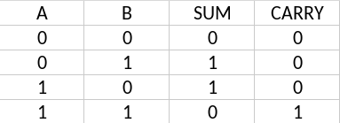
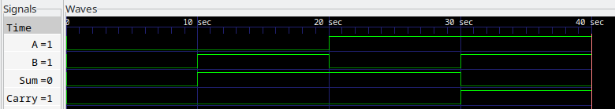

# Half-Adder

The half adder is a combinational logic circuit that performs binary addition of two inputs producing two outputs - SUM and CARRY. 

## Truth Table

## Circuit Diagram

The SUM is obatained from the XOR gate while the CARRY is obtained from the AND gate.

## Waveform Results

The waveform below shows the output of the half adder when all combinations of the input bits A and B are applied.

